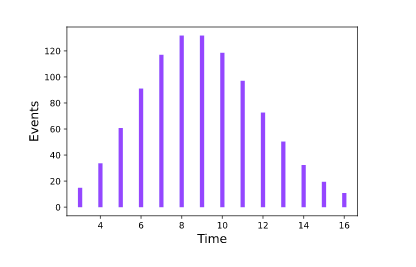

[](https://pypi.org/project/pydts/)
[](https://github.com/tomer1812/pydts/actions?workflow=Tests)
[](https://tomer1812.github.io/pydts)
[](https://codecov.io/gh/tomer1812/pydts)
[](https://doi.org/10.5281/zenodo.6466158)

# Discrete Time Survival Analysis  
A Python package for discrete-time survival data analysis with competing risks.

  

[Tomer Meir](https://tomer1812.github.io/), [Rom Gutman](https://github.com/RomGutman), [Malka Gorfine](https://www.tau.ac.il/~gorfinem/) 2022

[Documentation](https://tomer1812.github.io/pydts/)  

## Installation
```console
pip install pydts
```

## Quick Start

```python
from pydts.fitters import TwoStagesFitter
from pydts.examples_utils.generate_simulations_data import generate_quick_start_df

patients_df = generate_quick_start_df(n_patients=10000, n_cov=5, d_times=14, j_events=2, pid_col='pid', seed=0)

fitter = TwoStagesFitter()
fitter.fit(df=patients_df.drop(['C', 'T'], axis=1))
fitter.print_summary()
```

## Examples
1. [Usage Example](https://tomer1812.github.io/pydts/UsageExample-Intro/)
2. [Hospital Length of Stay Simulation Example](https://tomer1812.github.io/pydts/SimulatedDataset/)

## Citation
If you found PyDTS useful, please cite:

```bibtex
@article{Meir_PyDTS_2022,
    author = {Meir, Tomer and Gutman, Rom, and Gorfine, Malka},
    doi = {arXiv:2204.05731 [stat.ML]},
    title = {{PyDTS: A Python Package for Discrete Time Survival Analysis with Competing Risks}},
    url = {https://arxiv.org/abs/2204.05731},
    year = {2022}
}
```

and please consider starring the project [on GitHub](https://github.com/tomer1812/pydts)

## How to Contribute
1. Open Github issues to suggest new features or to report bugs\errors
2. Contact Tomer or Rom if you want to add a usage example to the documentation 
3. If you want to become a developer (thank you, we appreciate it!) - please contact Tomer or Rom for developers' on-boarding 

Tomer Meir: tomer1812@gmail.com, Rom Gutman: rom.gutman1@gmail.com